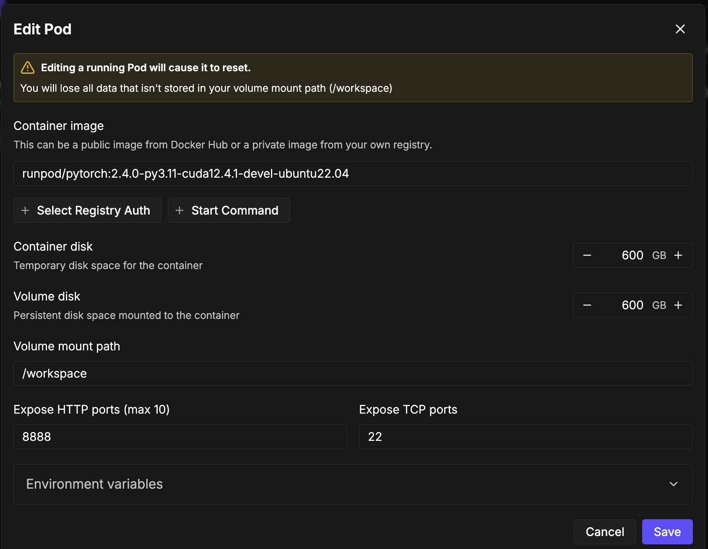

# RunPod Training Guide

This guide walks through setting up and running this repository on [RunPod](https://www.runpod.io/) for GPU-accelerated training and inference.

## 1. Create a Pod

From the RunPod dashboard, create a new GPU Pod with the following settings:



| Setting | Recommended Value |
|---------|-------------------|
| **Container image** | `runpod/pytorch:2.4.0-py3.11-cuda12.4.1-devel-ubuntu22.04` |
| **Container disk** | 600 GB |
| **Volume disk** | 600 GB |
| **Volume mount path** | `/workspace` |
| **Expose HTTP ports** | `8888` |
| **Expose TCP ports** | `22` |

Select a GPU with sufficient VRAM. For K-fold value function training, multi-GPU instances (e.g., 4x A100 80GB or 4x H100) are recommended. For inference only, a single GPU is sufficient.

Click **Save** to launch the pod.

## 2. Connect to the Pod

Once the pod is running, connect via SSH or the web terminal:

```bash
# Via SSH (find your SSH command in the RunPod dashboard)
ssh root@<your-pod-ip> -p <port>
```

## 3. Clone the Repository

```bash
cd /workspace
git clone https://github.com/Safe-Sentinel-Inc/reinforcement_learning_vla.git
cd reinforcement_learning_vla
```

## 4. Install Dependencies

```bash
# Install uv (fast Python package manager)
curl -LsSf https://astral.sh/uv/install.sh | sh
source $HOME/.local/bin/env

# Install all project dependencies
uv sync

# Verify installation
uv run python -c "import jax; print(f'JAX devices: {jax.devices()}')"
```

## 5. Download Model Checkpoints

Download the pretrained OpenPI checkpoints to get started:

```bash
# Download the base pi_0 checkpoint (required for both VF training and policy training)
# Replace with the actual checkpoint path for your task
mkdir -p checkpoints
# Example: gsutil cp -r gs://<bucket>/checkpoints/pi06_base checkpoints/
```

## 6. Prepare Your Dataset

Place your LeRobot-format dataset in the `lerobot_data/` directory:

```bash
mkdir -p lerobot_data
# Copy or symlink your dataset
# Example: ln -s /workspace/my_dataset lerobot_data/My_Task
```

If you have raw MCAP data, convert it first:

```bash
bash scripts/cmds/convert_mcap.sh
```

## 7. Run the Training Pipeline

Follow the pipeline steps from the main README:

```bash
# Step 1: Add progress labels and K-fold splits
bash scripts/cmds/add_labels.sh

# Step 2: Compute normalization statistics
bash scripts/cmds/compute_stats.sh

# Step 3: Train K-fold value functions
bash scripts/cmds/vf_kfold_train.sh

# Step 4: Label dataset with VF predictions
bash scripts/cmds/vf_kfold_label.sh

# Step 5: Train the advantage-conditioned policy
bash scripts/cmds/train_policy.sh
```

Edit the CONFIG section at the top of each shell script to match your dataset and GPU setup before running.

## 8. Run Inference

Start the policy server and run inference:

```bash
# Terminal 1: Start the policy server
bash scripts/cmds/serve_policy.sh

# Terminal 2: Run inference (use a second SSH session or tmux)
bash scripts/cmds/infer_async.sh
```

## 9. Monitor Training

Training logs are saved to the `logs/` directory. If Weights & Biases is configured, training metrics are also logged there:

```bash
# View latest training log
tail -f logs/train_policy_*.log

# View GPU utilization
nvidia-smi -l 1
```

## Tips

- **Persist data on the volume disk**: Store datasets, checkpoints, and results under `/workspace` so they survive pod restarts. The container disk is ephemeral.
- **GPU allocation**: Edit the `GPUS` variable in the shell scripts to match the GPUs available on your pod. Use `nvidia-smi` to check available devices.
- **Tmux/screen**: Use `tmux` or `screen` for long-running jobs so they persist if your SSH connection drops.
- **Disk space**: Large datasets and checkpoints can consume significant disk space. Monitor usage with `df -h /workspace`.
